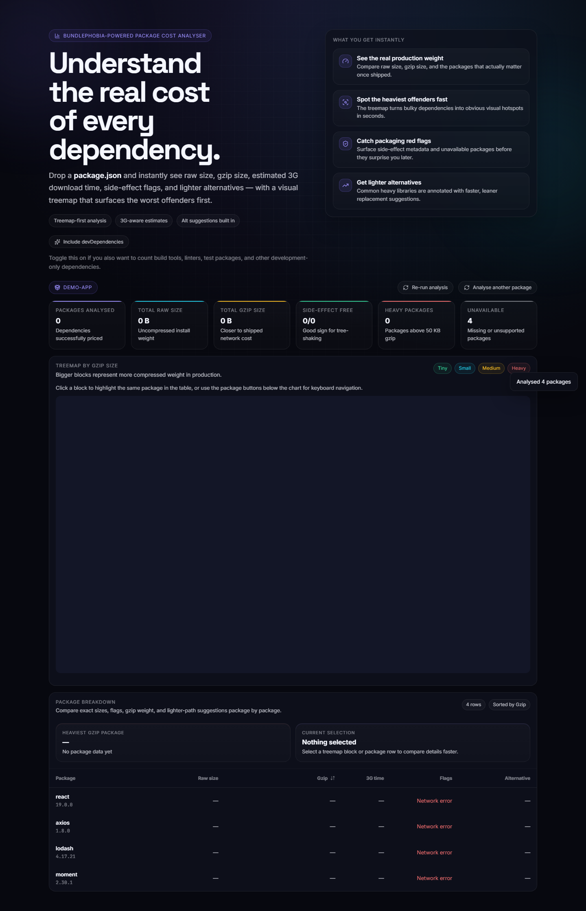

# bundle.check

A polished developer tool that lets you drop a `package.json` and instantly understand the real cost of every dependency.

It pulls live size data from Bundlephobia, visualises gzip weight in a treemap, estimates rough 3G download time, flags side-effect metadata, and suggests lighter alternatives for common heavy packages.



## Live Demo

- App: https://bundle-check.vercel.app
- Portfolio: https://terminal-chai-portfolio.vercel.app

## Highlights

- Drag-and-drop or paste raw `package.json`
- Optional `devDependencies` inclusion
- Live Bundlephobia-powered dependency analysis
- Treemap visualisation by gzip size
- Raw size, gzip size, and estimated 3G download time
- Side-effect metadata badges
- Suggested lighter alternatives for common heavy packages
- Keyboard-accessible interactions and improved focus states
- End-to-end Playwright coverage for core flows

## Built With

- React 19
- Vite 8
- Framer Motion
- Lucide React
- Bundlephobia API
- Playwright

## Core UX Flow

1. Drop or paste a `package.json`
2. Choose whether to include `devDependencies`
3. Run analysis against live package metadata
4. Inspect the treemap to spot the heaviest dependencies
5. Compare exact package rows in the breakdown table
6. Review lighter alternatives for swap candidates

## Why This Exists

A lot of bundle tooling is powerful but feels heavy, technical, or over-configured for quick dependency triage.

`bundle.check` is designed to be fast, visual, and easy to understand:

- useful for quick architecture reviews
- useful before shipping a new dependency
- useful when auditing old projects for unnecessary weight

## Local Development

```bash
git clone git@github-terminalchai:terminalchai/bundle-check.git
cd bundle-check
npm install
npm run dev
```

## Scripts

```bash
npm run dev
npm run build
npm run preview
npm run test:e2e
npm run test:e2e:headed
```

## Testing

The project includes Playwright coverage for the highest-value user journeys:

- landing page render
- invalid JSON handling
- analysis result rendering
- `devDependencies` toggle flow
- sort and reset flow

Run tests with:

```bash
npm run test:e2e
```

## Deployment

Deployed on Vercel:

- production URL: https://bundle-check.vercel.app
- pushes can be deployed directly from the connected repository

## Repository Notes

- This is a pure frontend app
- No backend or database required
- External package size data comes from the public Bundlephobia API

## License

ISC
